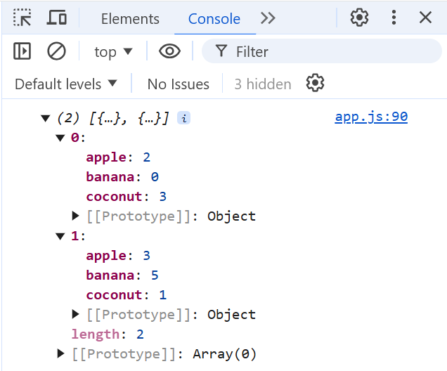

# CS272-F24 HW7: Badger Mart

In this HW, you will write functions to add, reset, checkout, and log transactions for a shopping cart!

## Important Notes

Please note that "Live Preview" will refresh your webpage each time that you save; this means that any global variables will be reset to their initial values. This is expected behavior! In a future lecture, we will discuss saving data to the browser via `sessionStorage` and `localStorage`, but for now, just beware that your global variables will reset each time you save.

You are *only* allowed to use the global variables given to you: `APPLE_COST`, `BANANA_COST`, `COCONUT_COST`, `cart`, and `transactions`. Introducing new *global* variables will cause you to lose points. You can create as many *local* variables and functions as you wish, however.

Also, be sure to take note of what each step requests of you. Some functions ask you to manipulate some error text element in the DOM, some ask you to `alert` the user, and some ask you to do both!  

## Instructions

### 1. `addToCart`

Implement the `addToCart` function such that it first checks if the amount, retrieved via `getAmount`, is a positive number. If it isn't, you should notify the user that "Please enter a positive number for an amount." via the `amn-error-text`. Otherwise, reset any add amount error text that may exist and update the corresponding number of apples, bananas, or coconuts (based on what was selected) in the cart. Finally, be sure to call `updateCart` to reflect these changes in the UI.

**Note:** This operation is *additive*, meaning that if the user adds 2 apples, then adds 3 apples, they will have a total of 5 apples in their cart.

**Also Note:** You only need to check that the number returned by `getAmount` exists and is positive. `getAmount` will always return null or an integer, based on the user input, even if the user enters a partial number.

### 2. `checkout`

Implement the `checkout` function such that it first checks if the cart is empty; if it is, notify the user that "You must have something in your cart to checkout!" via the `checkout-error-text`. Otherwise, reset any checkout error text that may exist, reset the cart to 0 apples, bananas, and coconuts, and `alert` the user that "Checkout complete! Thank you for your purchase.". Be sure to call `updateCart` to reflect these changes in the UI.

**Note:** In Step 4, you will be logging the list of transactions. You will need to re-visit this step to also add this `cart` to the list of `transactions`.

### 3. `resetCart`

Implement the `resetCart` function such that it resets the cart to 0 apples, bananas, and coconuts. Furthermore, any error text for "add" or "checkout" should be deleted. Be sure to call `updateCart` to reflect these changes in the UI.

### 4. `logTransactions`

Implement the `logTransactions` function such that the transactions list is simply printed to the `console.log` as a `list` of `object`. See below for a screenshot after two transactions. Then, `alert` the user with "Check your console to see the list of transactions!"

**Hint:** Seeing all 0's in your transaction history, even though you are *sure* you checked out with some items? In Step 2, be sure that you are assigning cart to a new object when checking out! Otherwise, all your transactions will point towards the same cart. Re-visiting the JS5 lecture may be helpful in your understanding.
